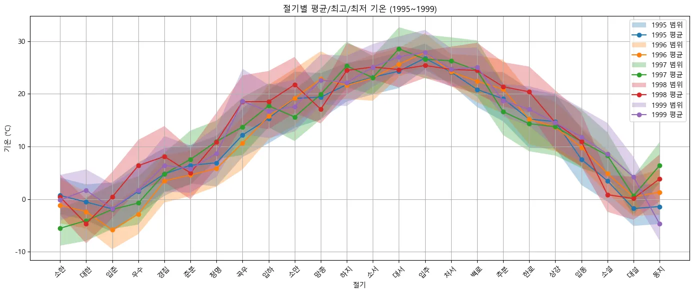
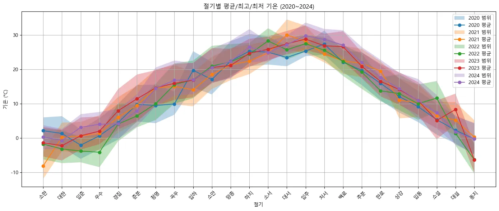
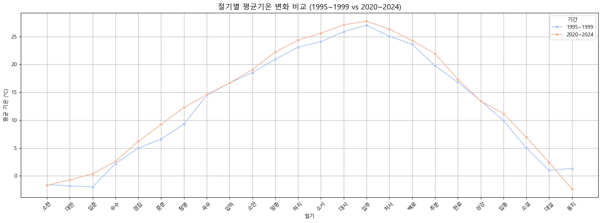
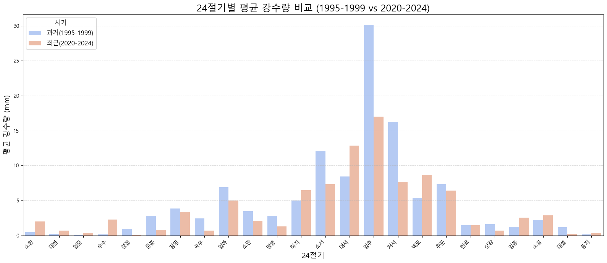

**SK네트웍스 Family AI 캠프 17기 Data Science 미니 프로젝트**

---

# 팀소개

 ### ✨4조 DataForce✨
      
👥 팀 멤버 (개인 GitHub)

| 이름  | GitHub 계정                                    |
| ----- | ---------------------------------------------- |
| 이가은 | [@Leegaeune](https://github.com/Leegaeune)    |
| 이민영 | [@mylee99125](https://github.com/mylee99125) |
| 조해리 | [@Haer111](https://github.com/Haer111)     |
| 주수빈 | [@Subin-Ju](https://github.com/Subin-Ju) |

---

# 프로젝트개요

## 💡 프로젝트 명

###  날씨 데이터를 활용한 24절기 변화 데이터

## 🌟 프로젝트 소개

## 🚀 프로젝트 필요성(배경)

---

## ✅ 데이터 출처 목록

| 데이터 이름                           | 파일 형식 / 수집 방법 | 출처 URL |
|--------------------------------------|------------------------|----------|

---

# 기술스택

  
  
  
  
  

---

# 데이터 전처리 과정

---

# 시각화
1. 절기별 최대/최소 기온 추이 | 이상 날씨 탐색
 
 

3. 절기별 평균 기온 변화 비교
 

4. 절기별 평균 강수량 비교
 

5. 절기별 온도 분포의 표준편차 변화
 
   

---

# 🔍  인사이트 도출
| 구분    | 과거 (1995\~1999) | 최근 (2020\~2024) | 변화 및 해석         |
| ----- | --------------- | --------------- | --------------- |
| 평균기온  | 낮음              | 높음              | 지구온난화 추세 반영     |
| 최저기온  | 매우 낮음           | 낮지만 상승          | 겨울 기온 완화, 한파 약화 |
| 기온 패턴 | 계절성 뚜렷, 일정      | 들쭉날쭉, 이상기온 혼재   | 기후 예측 난이도 증가    |
| 표준편차  | 작음              | 큼               | 날씨의 불안정성 심화     |

---

# 한 줄 회고

이가은 : 

이민영 :

조해리 :

주수빈 :

