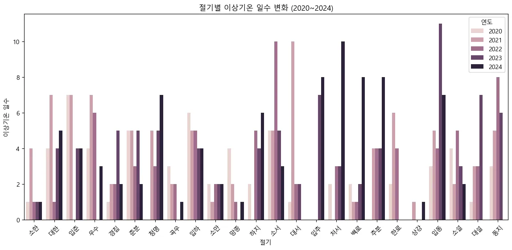
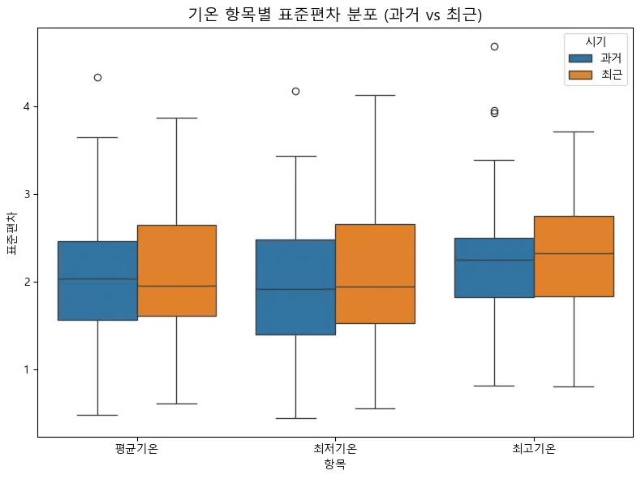

**SK네트웍스 Family AI 캠프 17기 Data Science 미니 프로젝트**

---

# 팀소개

 ### ✨4조 DataForce✨
      
👥 팀 멤버 (개인 GitHub)

| 이름  | GitHub 계정                                    |
| ----- | ---------------------------------------------- |
| 이가은 | [@Leegaeune](https://github.com/Leegaeune)    |
| 이민영 | [@mylee99125](https://github.com/mylee99125) |
| 조해리 | [@Haer111](https://github.com/Haer111)     |
| 주수빈 | [@Subin-Ju](https://github.com/Subin-Ju) |

---

## 💡 프로젝트 명

###  날씨 데이터를 활용한 24절기 변화 데이터

## 🌟 프로젝트 소개
오늘날의 기상 데이터를 바탕으로, 전통적으로 계절의 지표 역할을 해온 24절기와 실제 날씨 간의 일치 여부를 분석할 수 있다.
과거와 현재의 날씨 데이터를 비교하여 24절기가 가리키는 계절적 특성과 실제 기후 사이의 괴리 정도를 시각화하고, 이를 통해 계절감의 변화 양상을 확인할 수 있다.
또한, 분석 결과를 바탕으로 기후 변화의 징후를 파악하고, 지구 온난화에 대한 경각심을 제시하는 데 목적이 있다.

---

## ✅ 데이터 출처 목록

| 데이터 이름                           | 파일 형식 / 수집 방법 | 출처 URL |
|--------------------------------------|------------------------|----------|
| 종관기상관측(ASOS) - 자료      |  CSV  / 직접 다운로드  | [바로가기](https://data.kma.go.kr/data/grnd/selectAsosRltmList.do?pgmNo=36) |
---

# 🛠️ 기술스택

 
  
  
  
  
  
  
  

---

# 데이터 전처리 과정

* **CSV 파일 로드 및 컬럼명 통일**
    * 과거 (1995-1999), 최근 (2020-2024) 기상 데이터를 `pandas`를 사용하여 불러옴
    * `일시`, `평균기온(°C)` 등 원본 컬럼명을 `날짜`, `평균기온` 등으로 일관되게 변경

* **날짜 및 강수량 형식 변환**
    * `날짜` 컬럼은 `datetime` 형식으로 시간 기반 분석이 가능하도록 변환
    * `강수량` 컬럼은 숫자형(`float`)으로 변환, 결측값(NaN 또는 공백)은 `0.0`으로 처리

* **데이터 통합**
    * 과거 데이터(`df_past`)와 최근 데이터(`df_recent`)를 하나의 통합 데이터프레임으로 병합하여 전 기간에 걸친 분석 기반을 마련

* **절기 기준 데이터 생성**
    * 24절기의 기준 날짜를 중심으로 **±3일 범위**의 데이터를 추출
    * 24절기의 기준 날짜를 중심으로 **각 절기일 ±3일 범위의 데이터를 추출**
    * 이 추출된 데이터에서 **절기별 평균값 계산**하여 각 절기의 기후 특성을 파악
     
* **시기 구분 컬럼 추가**
    * 통합된 데이터 내에서 각 레코드가 '과거(1995-1999)' 시기인지 '최근(2020-2024)' 시기를 구분하는 `시기` 컬럼을 추가

* **절기 순서 정렬**
    * 24절기의 고유한 순서(예: 입춘 → 우수 → 경칩...)가 시각화 시에도 일관되게 유지되도록 `절기` 컬럼을 `Categorical` 타입으로 설정하고 순서를 지정

---

# 시각화
1. 절기별 최대/최소 기온 추이 | 이상 날씨 탐색
 
 

3. 절기별 평균 기온 변화 비교
 

4. 절기별 평균 강수량 비교
 

5. 절기별 이상기온 일수 변화
 
   
6. 절기별 온도 분포의 표준편차 변화
 
   

---

# 🔍 인사이트 도출
| 구분        | 과거 (1995~1999)      | 최근 (2020~2024)         | 변화 및 해석                  |
| ----------- | ------------------- | ---------------------- | --------------------------- |
| 평균기온    | 낮음                | 높음                   | 지구온난화 추세 반영        |
| 최저기온    | 매우 낮음           | 낮지만 상승            | 겨울 기온 완화, 한파 약화   |
| 기온 패턴   | 계절성 뚜렷, 일정   | 들쭉날쭉, 이상기온 혼재 | 기후 예측 난이도 증가       |
| 표준편차    | 작음                | 큼                     | 날씨의 불안정성 심화        |
| 강수량 패턴 | 여름철 특정 절기 집중 | 여름철 집중 완화, 연중 분산 | 강수 예측 난이도 증가, 국지성 강수 증가 |
---

# 한 줄 회고

이가은 : 
pandas를 활용한 시계열 전처리와 seaborn 기반의 절기별 시각화를 통해 24절기별 기상 데이터를 비교 분석하였으며, 데이터 분포 정제와 시기별 패턴의 통계적 특징을 도출하는 과정에서 기후 데이터 분석의 흐름과 기법을 체계적으로 익혔다.

이민영 :
‘기후변화’라는 거대한 이슈를 데이터로 체계적으로 해석할 수 있다는 점이 인상깊었습니다. 특히 절기별 이상기온 일수 증가는 ‘체감하는 이상기후‘가 아닌 ‘증명된 이상기후’를 발견했다는 점에서 의미 있었으며, 데이터가 단지 과거를 설명하는 도구가 아니라 미래를 위한 경고라는 걸 실감했습니다.

조해리 :
처음에 큰 주제를 정하고 구체화하는 과정에서 고민이 많았지만 흥미로운 주제를 선택했다고 생각한다. 절기별 기온 데이터의 표준편차를 비교해 기후의 불안정성을 분석하고자 했으나 기대했던 차이가 나타나지 않아 당황했고, 이런 결과를 그대로 제시해도 될지 많은 고민이 들었다. 어떤 관점에서 시각화를 해야할지 계속해서 고민하게 된 프로젝트였다.

주수빈 :
일상생활에서 느낀 의문점을 해결하고 싶어 선택한절 주제였기에 작업하는 과정에서 끝까지 흥미를 갖고 프로젝트를 수행할 수 있었다. 절기별 최대/최소 기온 추이 및 이상치를 탐색하고 시각화하기 위해 matplotlib을 사용하면서 크롤링한 데이터가 시각화되는 것이 신기했던 한편, 시각화로 보여지는 것에 따라 해석이 달라질 수 있다는 것을 느껴
내가 원하는 데이터 처리에 필요한 적절한 시각화 모델을 정하는 것에 대한 중요성도 느끼게 되었다. 또 중간에 각자 시각화를 진행한 결과를 합쳐보니 코드에 사용한 데이터프레임 명칭과 절기를 정렬하는 방식의 차이가 보여 이를 수정하는데 약간의 시간이 소요되었는데, 이 과정에서 협력 시 명칭 통일 및 수집 데이터 처리 방식에 대해 많은 의견을 나누어야 함을 배울 수 있었다.

